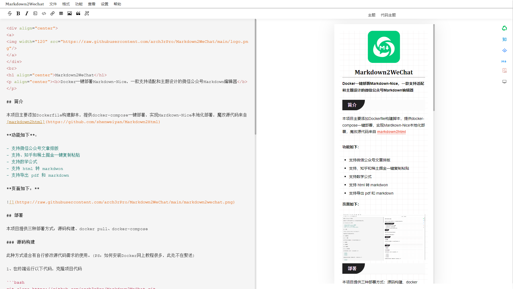

<div align="center">
<a>

</a>
</div>
<h1 align="center">Markdown2WeChat</h1>

<p align="center"><b>Docker一键部署Markdown-Nice，一款支持适配和主题设计的微信公众号Markdown编辑器</b></p>


## 简介

最近博客上线了微信公众号登录，所以申请了一个订阅号用于登录，这样一来想着博客的文章也能同步发布到公众号了，阅读会更方便一些。但是，微信公众号竟然不能直接用Markdown编辑，找了一圈文章发布工具，要么不支持Markdown编辑，要么发布后，公众号上排版格式有问题。然后看到了[Markdown-Nice](https://editor.mdnice.com/)，不过开源源码几乎不更新了，在线编辑器又需要登录。自行折腾了半天，Windows上安装各种报错，官网也没有安装文档，最后基于魔改的源码，通过Docker部署成功了。

本项目主要添加Dockerfile构建脚本，提供docker-compose一键部署，实现Mardkown-Nice本地化部署，魔改源代码来自 [markdown2html](https://github.com/shenweiyan/Markdown2Html)

**功能如下**：

- 支持微信公众号文章排版
- 支持、知乎和稀土掘金一键复制粘贴
- 支持数学公式
- 支持 html 转 markdwon
- 支持导出 pdf 和 markdown

**页面如下：**



## 部署

本项目提供三种部署方式：源码构建、docker pull、docker-compose

### 源码构建

此种方式适合有自行修改源代码需求的使用。(PS：如何安装Docker网上教程很多，此处不在赘述)

1、在终端运行以下代码，克隆项目代码

```bash
git clone https://github.com/arch3rPro/Markdown2WeChat.git
```

2、修改源代码后，使用以下代码，构建docker容器

```bash
docker build  -t vuldocker/markdown2wechat .
```

3、启动容器(项目启动需要一定时间，可通过日志查看是否启动完成)

```
docker run -itd -p3000:3000 --name Markdown vuldocker/markdown2wechat:latest /bin/bash
```

4、打开浏览器，访问http://your-ip.com:3000即可使用平台

### docker pull

如果不需要修改源代码，只需要简单部署完使用平台，推荐这种方式，省去Dockerfile构建时间和避免一些报错问题，容器镜像已经上传到Dockerhub官网仓库，访问速度如果较慢，可以使用类似阿里云的容器镜像加速服务。

1、在终端运行以下代码，下载容器镜像

```
docker pull vuldocker/markdown2wechat
```

2、启动容器(同上)

```
docker run -itd -p3000:3000 --name Markdown vuldocker/markdown2wechat:latest /bin/bash
```

3、打开浏览器，访问http://your-ip.com:3000即可使用平台

### docker-compose

1、项目内，提供docker-compose.yml 启动脚本，可以在构建容器后或者docker pull 下载完容器镜像后，再执行以下代码，也可以执行以下代码构建

```
docker-compose up -d
```

2、docker-compose.yml 外部映射端口为3000,可根据个人需求，修改配置文件中的端口

### 使用方式

此项目提供在线Makrdown编辑器，左侧输入Markdown文档，右侧显示公众号中的预览样式，可选择主题或者代码主题更换预览的样式。完成文档编辑后，点击右侧的公众号按钮或者其他平台按钮完成复制，然后粘贴到各自平台发布文章地方进行粘贴即可。

## 源项目链接

感谢以下项目进行项目开源和优化修改

- [markdown2html](https://github.com/shenweiyan/Markdown2Html)：markdown2html
- [markdown nice](https://mdnice.com/)：markdown nice
